# 🔥 FIRE Tracker
### Financial Independence, Retire Early

A modern, interactive financial planning tool designed to help you demystify the path to Financial Freedom. Built with precision, aesthetics, and user experience in mind.

---

## 🚀 About The Project

**FIRE Tracker** is more than just a calculator; it's an educational platform. Whether you're aiming for a minimalist "Lean FIRE" or a luxurious "Fat FIRE", this tool helps you visualize your future.

**Key Features:**
- **Smart Calculator**: Input your financials and get your "Freedom Date" instantly.
- **FIRE Types Guide**: Learn the differences between Coast, Barista, Lean, Traditional, Slow, and Fat FIRE.
- **PDF Reports**: Download a detailed summary of your financial roadmap.
- **Smart Previews**: High-quality report previews powered by Cloudinary.
- **Responsive Design**: Beautifully crafted interface that works on all devices.

---

## 🛠️ How To Use

1.  **Explore the Concepts**: Scroll through the "Simple Truths" and "What is FIRE?" sections to understand the basics.
2.  **Choose Your Path**: Use the "FIRE Types" section to find the lifestyle that fits you (e.g., *Coast FIRE* vs *Fat FIRE*).
3.  **Crunch the Numbers**:
    *   Navigate to the **Calculator** section.
    *   Enter your current age, income, expenses, and savings.
    *   Adjust the sliders to see how small changes impact your freedom date.
4.  **Save Your Plan**: Click "Download Report" to get a professional PDF of your strategy.

---

## 🧠 Project Mind Map (Detailed Workflow)

```mermaid
mindmap
  root((FIRE Number Web App | firetracker.in))
    User_Education_Layer["User Education Layer(Financial Awareness Before Action)"]
      What_is_FIRE["What is FIRE Number?"]
      Why_FIRE["Why FIRE is Important"]
      Where_FIRE["Where FIRE is Used"]
      Types_of_FIRE["Types of FIRE"]
        Lean_FIRE["Lean FIRE"]
        Fat_FIRE["Fat FIRE"]
        Coast_FIRE["Coast FIRE"]
        Barista_FIRE["Barista FIRE"]
        Traditional_FIRE["Traditional FIRE"]
        Slow_FIRE["Slow FIRE"]
      Simple_Truths["Simple Truths of FIRE"]
      Real_Life_Impact["Real-life Impact"]
      FAQ["FAQ Section"]

    User_Input_Selection["User Input & Selection(Personalization Entry Point)"]
      Calculation_Type["Select Calculation Type"]
        Income_Based["Income-based FIRE"]
        Goal_Based["Goal-based FIRE"]
      Financial_Inputs["Financial Inputs"]
        Expenses["Expenses"]
        Lifestyle_Goals["Lifestyle Goals"]
        Targets["Targets"]
        Age["Age"]

    Frontend_Engine["Frontend Calculation Engine(Client-side Logic)"]
      JS_Calc["JavaScript-based Calculations"]
      Real_Time["Real-time Processing"]
      No_Backend["No Backend Dependency"]
      Privacy["Privacy-friendly (No Data Storage)"]

    Result_Interpretation["Result Interpretation(Meaningful Output)"]
      FIRE_Number["Personalized FIRE Number"]
      Explanation["Explanation of Calculation"]
      Insights["Contextual Insights"]

    PDF_Generation["PDF Report Generation(Structured Financial Summary)"]
      Input_Summary["User Inputs Summary"]
      Result["FIRE Number Result"]
      Guidance["Interpretation & Guidance"]
      PDF_Export["Exported as PDF"]

    Download_Sharing["Download & Sharing Layer(Device-Aware UX)"]
      Download["Download PDF"]
        Mobile_Download["Mobile ✔"]
        Desktop_Download["Desktop ✔"]
      Sharing_Logic["Sharing Logic"]
        Mobile_Share["Mobile → Direct PDF Share"]
        Desktop_Share["Desktop → Cloudinary Upload → Shareable Link"]

    Final_Outcome["Final User Outcome(Actionable Financial Clarity)"]
      Awareness["Better Financial Awareness"]
      Shareable["Shareable Report"]
      Planning["Practical FIRE Planning"]
```



---

## 💻 How to Run This Website Locally

**This is a frontend-only application built using React and Vite. No backend or authentication setup is required.**

### 📦 Prerequisites

Node.js (v16 or above recommended)

npm (comes with Node.js)

### 🔑 Configuration

To enable the report preview feature, you need to configure Cloudinary. Create a `.env` file in the root directory and add the following keys:

```bash
VITE_CLOUDINARY_CLOUD_NAME=your_cloud_name
VITE_CLOUDINARY_UPLOAD_PRESET=your_upload_preset
```

> **Note:** Without these credentials, the calculator will work, but report previews/sharing features may be limited.

### ▶️ Steps to Run

Clone the repository:
```bash
git clone https://github.com/Rebaka8/retirement-calculator-app
```

Navigate to the project directory:
```bash
cd fire-calculator
```

Install dependencies:
```bash
npm install
```

Start the development server:
```bash
npm run dev
```

Open your browser and visit:
```bash
http://localhost:5173
```

**The website will load instantly and you can start using the FIRE calculator without any login or setup.**

---

*Code, Caffeine, and Compound Interest.*  
*Hand-crafted by **[Rebaka Meda](https://www.linkedin.com/in/rebaka-meda-6832b2367)** to fast-track your freedom. 🚀*
